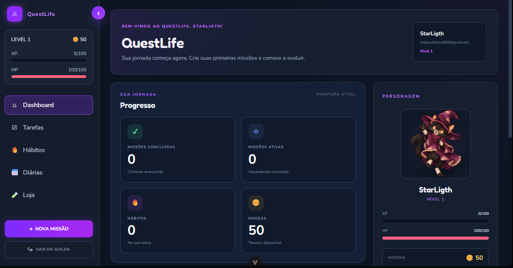
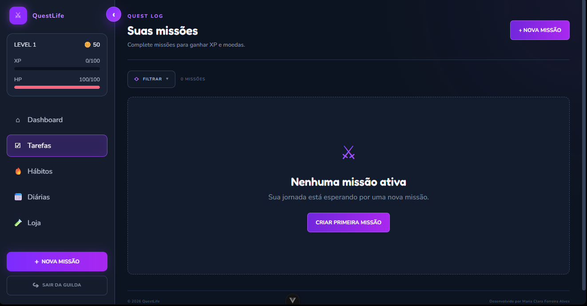
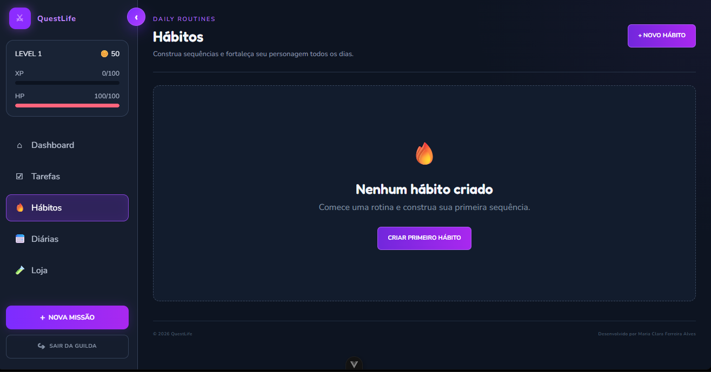
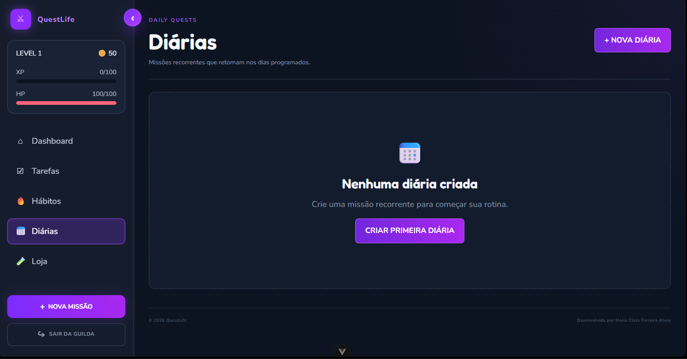
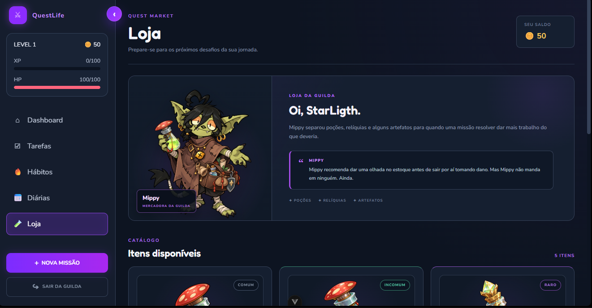
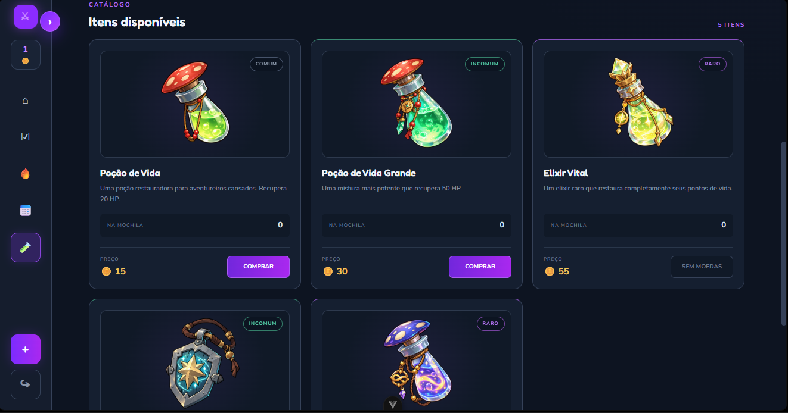
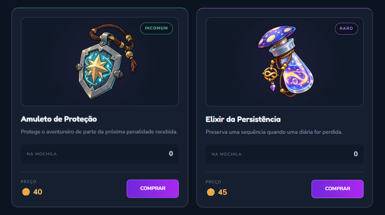
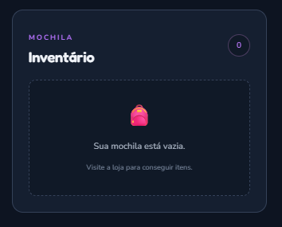
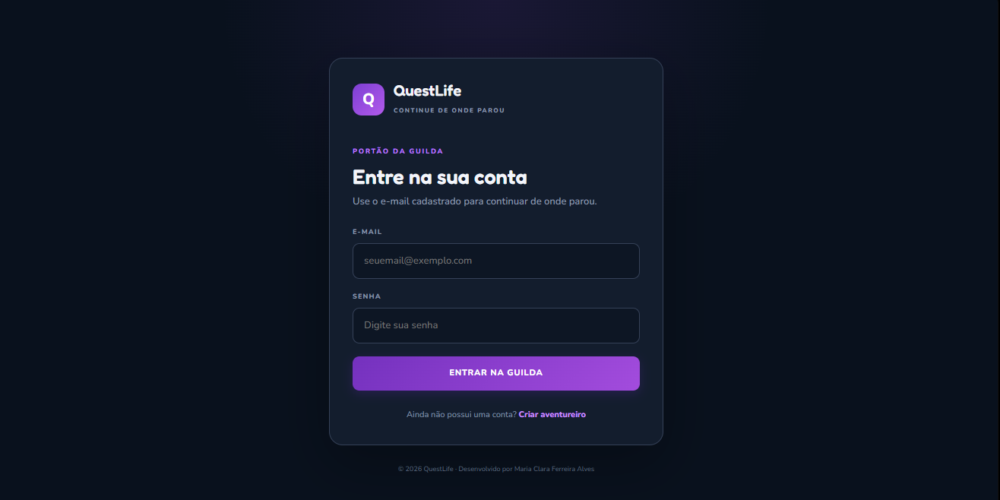

# ⚔️ QuestLife

<p align="center">
  <strong>Transforme suas tarefas em uma aventura.</strong>
</p>

<p align="center">
  Uma aplicação de produtividade gamificada que transforma tarefas, hábitos e rotinas em missões de RPG.
</p>

---

## 📖 Sobre o QuestLife

O **QuestLife** é uma aplicação web de produtividade gamificada criada para tornar a organização da rotina mais envolvente.

Em vez de apenas marcar atividades como concluídas, o usuário assume o papel de um aventureiro que progride conforme cumpre suas responsabilidades.

Tarefas se tornam **missões**, hábitos constroem **sequências**, atividades concluídas concedem **XP e moedas**, enquanto falhas podem causar **dano ao HP**.

O progresso também pode ser utilizado na **Loja da Guilda**, onde itens e poções ajudam o jogador durante sua jornada.

### 🎯 A proposta

O objetivo é unir dois conceitos:

**Produtividade + Gamificação**

```text
Organizar a rotina
        ↓
Completar atividades
        ↓
Receber recompensas
        ↓
Evoluir o personagem
        ↓
Manter constância
```

---

# 🖼️ Screenshots

## 🏠 Dashboard

O Dashboard reúne as principais informações da jornada do jogador:

- nível;
- XP;
- HP;
- moedas;
- progresso;
- personagem;
- inventário;
- missões ativas.

<p align="center">
  
</p>

---

## ✅ Tarefas

As tarefas funcionam como **missões pontuais**.

O usuário pode criar, editar, excluir e concluir missões, além de utilizar subtarefas para dividir objetivos maiores.

<p align="center">
  
</p>

---

## 🔥 Hábitos

Os hábitos representam atividades recorrentes que ajudam o jogador a construir constância.

É possível acompanhar frequência, dias programados, progresso e sequência.

<p align="center">
  
</p>

---

## 📅 Diárias

As diárias permitem organizar atividades recorrentes em dias específicos da semana.

<p align="center">
  
</p>

---

## 🧪 Loja da Guilda

A Loja da Guilda permite utilizar as moedas conquistadas durante a jornada para comprar poções, relíquias e itens especiais.

<p align="center">
  
</p>

<p align="center">
  
</p>

<p align="center">
  
</p>

---

## 🎒 Inventário

Os itens comprados ficam armazenados na mochila do jogador e podem ser utilizados durante sua jornada.

<p align="center">
  
</p>

---

## 🔐 Login

O QuestLife possui cadastro e login local, permitindo que diferentes usuários tenham seus próprios dados e progresso.

<p align="center">
  
</p>

---

# ✨ Funcionalidades

## 🔐 Cadastro e autenticação local

O usuário pode:

- criar uma conta;
- utilizar e-mail e senha;
- confirmar a senha durante o cadastro;
- visualizar ou ocultar a senha enquanto digita;
- entrar novamente em uma conta existente;
- sair da sessão.

Cada conta possui seus próprios dados.

Isso significa que tarefas, hábitos, diárias, XP, HP, moedas, inventário e efeitos ficam separados por usuário.

> ⚠️ A autenticação atual foi criada para fins acadêmicos e demonstrativos. O projeto ainda não possui backend de autenticação.

---

## 👋 Experiência de novos usuários

O sistema diferencia um aventureiro recém-criado de um usuário que está retornando.

Ao criar uma nova conta:

```text
BEM-VINDO AO QUESTLIFE, AVENTUREIRO!
Sua jornada começa agora.
```

Ao entrar novamente:

```text
QUE BOM TER VOCÊ DE VOLTA, AVENTUREIRO!
Continue suas missões e sua evolução.
```

Novos jogadores também recebem um presente inicial da Guilda para começar sua jornada.

---

# 👤 Sistema do jogador

Cada aventureiro possui:

| Atributo | Função |
|---|---|
| 🎚️ Nível | Representa a evolução geral |
| ⭐ XP | Experiência conquistada |
| ❤️ HP | Pontos de vida |
| 🪙 Moedas | Utilizadas na Loja da Guilda |
| 🎒 Inventário | Armazena itens comprados |
| ✨ Efeitos | Proteções e bônus ativos |

---

# ✅ Tarefas

As tarefas representam missões que possuem um objetivo específico.

O sistema permite:

- criação;
- edição;
- exclusão;
- conclusão;
- subtarefas;
- dificuldade;
- recompensas;
- filtros.

As subtarefas ajudam a dividir missões maiores em pequenas etapas.

Ao concluir uma missão, o jogador recebe recompensas de acordo com sua dificuldade.

---

# 🔥 Hábitos

Os hábitos representam atividades que fazem parte da rotina.

É possível:

- criar hábitos;
- editar;
- excluir;
- escolher frequência;
- selecionar dias da semana;
- registrar conclusão;
- registrar falha;
- acompanhar sequência;
- acompanhar progresso;
- utilizar filtros.

Quando um hábito é realizado, sua sequência pode aumentar.

Quando uma falha ocorre, o jogador pode sofrer dano e perder a sequência.

---

# 📅 Diárias

As diárias são atividades recorrentes programadas para dias específicos.

O sistema permite:

- criação;
- programação por dia da semana;
- dificuldade;
- conclusão;
- falha;
- sequência;
- filtros;
- indicação se a atividade está programada para o dia atual.

---

# ⚔️ Sistema de dificuldade

Cada atividade pode possuir um nível de dificuldade.

| Dificuldade | Recompensa | Risco |
|---|---:|---:|
| ⚪ Trivial | Baixa | Baixo |
| 🟢 Fácil | Baixa | Baixo |
| 🟡 Médio | Média | Médio |
| 🔴 Difícil | Alta | Alto |
| 🟣 Lendário | Muito alta | Muito alto |

Cada dificuldade possui seus próprios valores de:

- XP;
- moedas;
- dano.

Quanto maior a dificuldade, maiores podem ser tanto a recompensa quanto a penalidade.

---

# 🎮 Gamificação

## ⭐ XP

Atividades concluídas concedem experiência.

O XP representa o progresso do jogador até o próximo nível.

---

## 🎚️ Níveis

Ao atingir a quantidade necessária de XP, o aventureiro pode evoluir de nível.

---

## ❤️ HP

O HP representa a vida do personagem.

Falhas podem causar dano de acordo com a dificuldade da atividade.

---

## 🪙 Moedas

As moedas são conquistadas através das atividades e podem ser utilizadas na Loja da Guilda.

---

## 🔥 Sequências

Hábitos e diárias podem construir sequências de conclusão.

A sequência representa a constância do jogador ao longo do tempo.

---

# 🧪 Loja da Guilda

A Loja da Guilda é responsável por oferecer itens úteis durante a jornada.

E quem cuida dela é:

## 🐾 Mippy

**Mercadora da Guilda**

Mippy vende poções, relíquias e artefatos para aventureiros que talvez estejam confiando demais na própria sorte.

> “Mippy recomenda dar uma olhada no estoque antes de sair por aí tomando dano. Mas Mippy não manda em ninguém. Ainda.”

---

# 🎒 Itens disponíveis

## ❤️ Poção de Vida

Recupera parte do HP do jogador.

---

## ❤️‍🔥 Poção de Vida Grande

Recupera uma quantidade maior de HP.

---

## ✨ Elixir Vital

Restaura completamente os pontos de vida.

---

## 🛡️ Amuleto de Proteção

Protege o HP contra a penalidade de uma falha no alvo escolhido.

---

## 🔮 Elixir da Persistência

Protege a sequência de um hábito ou diária contra uma falha.

---

# 🛡️ Estratégia dos itens especiais

O **Amuleto de Proteção** e o **Elixir da Persistência** possuem funções diferentes.

```text
Sem proteção
→ perde HP
→ pode perder a sequência

Com Amuleto
→ HP protegido
→ sequência pode ser perdida

Com Elixir
→ HP pode sofrer dano
→ sequência protegida

Com os dois
→ HP protegido
→ sequência protegida
```

Assim, o jogador pode decidir qual consequência deseja evitar.

---

# 🎒 Inventário

Os itens adquiridos ficam armazenados na mochila.

O inventário permite:

- visualizar itens;
- utilizar poções;
- ativar proteções;
- escolher o alvo de itens especiais;
- visualizar efeitos ativos;
- cancelar determinadas proteções.

Quando uma proteção é cancelada antes de ser consumida, o item pode retornar à mochila.

---

# 💾 Persistência de dados

Atualmente, o QuestLife utiliza o `localStorage` do navegador.

São armazenados dados como:

```text
Conta
├── jogador
│   ├── nível
│   ├── XP
│   ├── HP
│   └── moedas
│
├── tarefas
├── hábitos
├── diárias
├── inventário
└── efeitos ativos
```

Isso permite atualizar ou fechar a página sem perder o progresso salvo naquele navegador.

---

# 👥 Separação entre usuários

Cada usuário possui seu próprio espaço de armazenamento.

```text
Usuário A
├── perfil
├── tarefas
├── hábitos
├── diárias
└── inventário

Usuário B
├── perfil
├── tarefas
├── hábitos
├── diárias
└── inventário
```

Os dados de uma conta não são utilizados pela outra.

---

# 🎨 Interface

A identidade visual do QuestLife mistura elementos de:

- RPG;
- fantasia;
- produtividade;
- interfaces de jogos;
- sistemas de progressão.

A paleta utiliza principalmente tons:

- azul-marinho;
- roxo;
- rosa;
- dourado;
- fundos escuros.

A interface possui:

- sidebar recolhível;
- dashboard;
- cards;
- indicadores de XP e HP;
- filtros;
- formulários;
- loja;
- inventário;
- modais;
- mensagens de feedback;
- estados vazios;
- adaptação para diferentes tamanhos de tela.

---

# 🧠 Organização da aplicação

A lógica foi separada em serviços para evitar concentrar todas as regras diretamente nos componentes Vue.

```text
Interface
    ↓
Views / Components
    ↓
Services
    ↓
LocalStorage
```

---

# 🗂️ Estrutura do projeto

```text
QuestLife/
├── docs/
│   ├── dashboard.png
│   ├── dailies.png
│   ├── habits.png
│   ├── inventory.png
│   ├── login.png
│   ├── shop1.png
│   ├── shop2.png
│   ├── shop3.png
│   └── tasks.png
│
├── src/
│   ├── components/
│   │   ├── auth/
│   │   ├── dailies/
│   │   ├── dashboard/
│   │   ├── habits/
│   │   ├── shop/
│   │   └── tasks/
│   │
│   ├── data/
│   ├── router/
│   ├── services/
│   ├── views/
│   ├── App.vue
│   ├── main.js
│   └── style.css
│
├── README.md
├── package.json
└── vite.config.js
```

---

# ⚙️ Serviços

## 🔐 `authService.js`

Responsável por:

- contas;
- cadastro;
- login;
- sessão.

---

## 👤 `playerService.js`

Responsável pelo estado e persistência do jogador.

---

## 🎮 `gameService.js`

Responsável por regras de gamificação como:

- XP;
- moedas;
- dano;
- evolução.

---

## ✅ `taskService.js`

Gerencia as tarefas.

---

## 🔥 `habitService.js`

Gerencia hábitos, frequências e sequências.

---

## 📅 `dailyService.js`

Gerencia atividades diárias e programação.

---

## 🧪 `shopService.js`

Gerencia:

- compras;
- itens;
- inventário;
- efeitos especiais.

---

## 💾 `storageService.js`

Centraliza operações de armazenamento local.

---

# 🛠️ Tecnologias

| Tecnologia | Uso |
|---|---|
| Vue 3 | Interface baseada em componentes |
| Vite | Ambiente de desenvolvimento e build |
| JavaScript | Lógica da aplicação |
| HTML5 | Estrutura |
| CSS3 | Estilização |
| Vue Router | Navegação |
| LocalStorage | Persistência local |
| npm | Gerenciamento de dependências |
| Git | Versionamento |
| GitHub | Repositório e colaboração |

---

# 🔧 Ferramentas utilizadas

- VS Code / VSCodium
- GitHub
- GitHub Projects
- npm
- Git

---

# 🚀 Como executar

### 1. Clone o repositório

```bash
git clone https://github.com/mariaclaraferreira08/QuestLife.git
```

### 2. Entre na pasta

```bash
cd QuestLife
```

### 3. Instale as dependências

```bash
npm install
```

### 4. Inicie o ambiente de desenvolvimento

```bash
npm run dev
```

O Vite exibirá um endereço local semelhante a:

```text
http://localhost:5173
```

---

# 📦 Build de produção

Para gerar a aplicação otimizada:

```bash
npm run build
```

Os arquivos de produção serão gerados em:

```text
dist/
```

---

# 🧭 Fluxo principal

```text
Cadastro / Login
        ↓
Dashboard
        ↓
Criar missão
   ↙     ↓      ↘
Tarefa Hábito  Diária
   ↘     ↓      ↙
   Concluir atividade
        ↓
    XP + Moedas
        ↓
      Evolução
        ↓
  Loja da Guilda
        ↓
     Inventário
        ↓
   Novas missões
```

---

# 🆕 Atualizações recentes

A etapa mais recente de desenvolvimento trouxe melhorias tanto na lógica quanto na experiência de uso.

## 🔐 Autenticação

- cadastro de usuários;
- login por e-mail;
- contas separadas;
- regras de senha;
- confirmação de senha;
- mostrar e ocultar senha;
- logout;
- sessão local.

## 👋 Novos aventureiros

- mensagem específica para contas recém-criadas;
- mensagem diferente para usuários que retornam;
- presente inicial de moedas.

## 🏠 Dashboard

- reorganização das informações;
- resumo de progresso;
- personagem;
- XP;
- HP;
- moedas;
- inventário;
- missões ativas.

## ✅ Tarefas

- melhorias no CRUD;
- subtarefas;
- filtros;
- recompensas;
- feedbacks.

## 🔥 Hábitos

- programação por frequência;
- seleção de dias;
- sequências;
- registro de falhas;
- filtros;
- indicação dos dias programados.

## 📅 Diárias

- programação semanal;
- indicação de atividade programada;
- sequências;
- filtros;
- conclusão e falha.

## 🧪 Loja

- criação da personagem Mippy;
- diferentes tipos de poções;
- Amuleto de Proteção;
- Elixir da Persistência;
- inventário;
- efeitos ativos;
- cancelamento de proteções.

## 🎨 Experiência

- revisão dos textos;
- linguagem mais natural;
- feedbacks temporários;
- melhorias de interface;
- maior consistência visual.

---

# 🗺️ Próximas atualizações

Algumas melhorias que podem ser implementadas em versões futuras próximas:

### 📊 Estatísticas básicas

Criar uma nova página mostrando:

- total de tarefas concluídas;
- hábitos realizados;
- melhor sequência;
- XP conquistado;
- moedas obtidas;
- quantidade de falhas.

---

### 🏆 Conquistas

Adicionar pequenas conquistas, como:

```text
🏆 Primeiros Passos
Complete sua primeira missão.

🔥 Imparável
Mantenha uma sequência de 7 dias.

⚔️ Veterano
Complete 50 missões.

💰 Comerciante Frequente
Compre 10 itens da Mippy.
```

---

### 🧪 Novos itens

Adicionar mais opções à loja, como:

- bônus de XP;
- multiplicador de moedas;
- recuperação parcial de sequência;
- proteções extras;
- itens cosméticos.

---

### 🐾 Mais falas da Mippy

Mippy poderá reagir ao estado atual do jogador.

```text
HP baixo
→ “Mippy não quer questionar suas decisões...
   mas uma poção seria um começo.”

Poucas moedas
→ “Mippy aceita moedas.
   Promessas de pagamento não contam como moedas.”

Inventário vazio
→ “Mippy viu essa mochila vazia.
   Mippy prefere fingir que não viu.”

Nível alto
→ “Mippy admite que você está ficando bom.
   Não se acostume com elogios.”
```

---

# 🔮 Possíveis funções futuras

Além das próximas atualizações, o QuestLife pode evoluir para um sistema muito maior.

## 🌐 Backend próprio

Substituir o armazenamento exclusivamente local por uma API.

Possibilidades:

- Django;
- Node.js;
- API REST.

---

## 🗄️ Banco de dados

Migrar dados para um banco de dados real.

Isso permitiria:

- sincronização;
- backups;
- histórico;
- dados persistentes em servidor.

---

## 🔐 Autenticação completa

Adicionar:

- recuperação de senha;
- verificação de e-mail;
- tokens;
- sessões seguras;
- redefinição de senha.

---

## ☁️ Sincronização entre dispositivos

O mesmo aventureiro poderia acessar sua jornada em:

```text
Notebook
   ↕
Servidor
   ↕
Celular
```

---

## 🧙 Personalização do personagem

Adicionar:

- avatares;
- roupas;
- chapéus;
- acessórios;
- títulos;
- fundos;
- itens cosméticos.

---

## 🏆 Sistema avançado de conquistas

Criar conquistas baseadas em:

- nível;
- sequência;
- tarefas;
- hábitos;
- diárias;
- moedas;
- eventos especiais.

---

## 📈 Dashboard de estatísticas

Mostrar informações como:

- produtividade semanal;
- produtividade mensal;
- atividades concluídas;
- atividades falhadas;
- evolução de XP;
- maiores sequências.

---

## 📊 Gráficos

Possibilidades:

- atividades por dia;
- dias mais produtivos;
- distribuição por dificuldade;
- evolução do nível;
- evolução das sequências.

---

## 🔔 Notificações

Lembrar o jogador de:

- missões pendentes;
- diárias;
- hábitos;
- sequências em risco;
- prazos.

---

## 📆 Calendário

Adicionar uma visão:

- diária;
- semanal;
- mensal.

Permitindo visualizar tarefas e compromissos por data.

---

## ⚔️ Missões especiais

Exemplos:

```text
Complete 5 missões nesta semana.

Mantenha um hábito durante 7 dias.

Complete todas as suas diárias hoje.

Conclua uma missão lendária.
```

---

## 🐉 Eventos e desafios

Criar eventos temporários com:

- missões especiais;
- recompensas únicas;
- itens exclusivos;
- eventos sazonais;
- desafios semanais.

---

## 👥 Recursos sociais

Possíveis funcionalidades:

- amigos;
- guildas;
- grupos;
- desafios cooperativos;
- rankings opcionais.

---

## 🏰 Guildas

Usuários poderiam criar grupos e trabalhar em objetivos em conjunto.

Exemplo:

```text
Guilda
├── membros
├── missões coletivas
├── progresso
├── recompensas
└── ranking interno
```

---

## 🐉 Chefes

Uma evolução mais voltada à gamificação poderia introduzir chefes.

As atividades concluídas causariam dano ao chefe.

```text
Completar tarefa
      ↓
Causar dano
      ↓
Derrotar chefe
      ↓
Receber recompensa
```

---

## 📱 Aplicativo mobile

Criar uma versão para dispositivos móveis mantendo a mesma conta e progresso.

---

## 🌐 Publicação online

Hospedar o QuestLife para que usuários possam acessar sem precisar executar localmente.

---

# ⚠️ Limitações atuais

A versão atual foi desenvolvida como projeto acadêmico e MVP.

Atualmente:

- os dados permanecem no navegador;
- não há sincronização entre dispositivos;
- não existe backend;
- a autenticação é local;
- não existe recuperação de senha;
- não há banco de dados remoto.

Essas limitações fazem parte do escopo atual e são pontos naturais de evolução do projeto.

---

# 🎯 Objetivo acadêmico

O projeto foi desenvolvido para aplicar conhecimentos de desenvolvimento web e lógica de programação em uma aplicação funcional.

Durante o desenvolvimento foram trabalhados conceitos como:

- componentização;
- CRUD;
- formulários;
- JavaScript;
- gerenciamento de estado;
- roteamento;
- persistência;
- regras de negócio;
- arquitetura de código;
- Git;
- GitHub;
- Vue.

---

# ✅ Status atual

```text
✅ Cadastro
✅ Login
✅ Regras de senha
✅ Mostrar/ocultar senha
✅ Perfis separados
✅ Sessão local

✅ Tarefas
✅ Subtarefas
✅ Hábitos
✅ Diárias
✅ Filtros
✅ Frequências

✅ XP
✅ HP
✅ Moedas
✅ Níveis
✅ Dificuldades
✅ Sequências

✅ Loja
✅ Mippy
✅ Inventário
✅ Poções
✅ Amuleto de Proteção
✅ Elixir da Persistência
✅ Efeitos ativos

✅ Persistência local
✅ Interface responsiva
✅ Build de produção
```

---

# 👩‍💻 Autora

**Maria Clara Ferreira Alves**

Estudante de **Análise e Desenvolvimento de Sistemas**.

Áreas de interesse:

- Engenharia de Software
- Engenharia de Dados
- Backend

---

# 🔗 Repositório

**GitHub**

https://github.com/mariaclaraferreira08/QuestLife

---

# 📄 Licença e uso

Este projeto foi desenvolvido para fins:

- acadêmicos;
- educacionais;
- de estudo;
- de portfólio.

---

<p align="center">
  ⚔️ <strong>QuestLife</strong>
</p>

<p align="center">
  Transforme suas tarefas em uma aventura.
</p>

<p align="center">
  © 2026 · Desenvolvido por Maria Clara Ferreira Alves
</p>